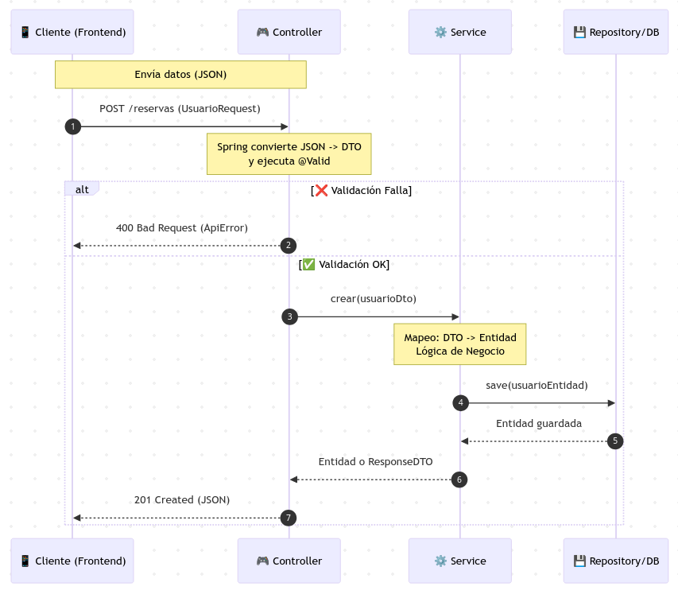
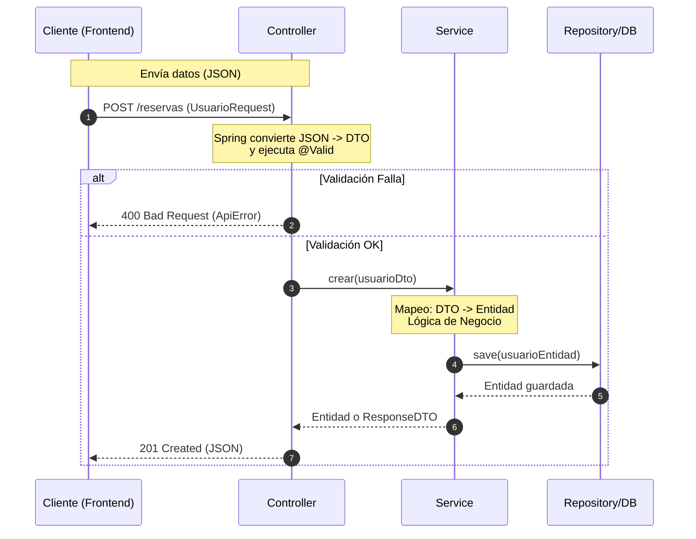
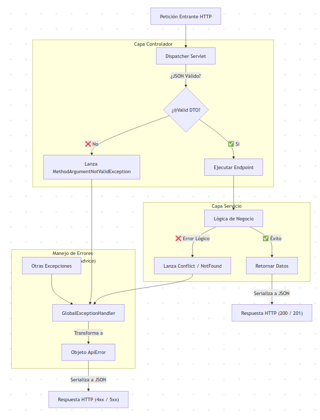

## Validación, DTOs y Control de Errores (`@ControllerAdvice`)

En el desarrollo de una API REST profesional, no basta con que el código "funcione". Debe ser robusto, seguro y fácil de mantener. Para ello, nos apoyamos en dos pilares fundamentales: el patrón **DTO** para la transferencia de datos y un **Manejador Global de Excepciones**.

En una API REST, la validación de datos y la gestión homogénea de errores son elementos esenciales para garantizar que el sistema:

* Rechaza entradas inválidas antes de persistirlas.
* Responde con **códigos HTTP correctos** y mensajes consistentes.
* Facilita el consumo desde el frontend (manejo de errores predecible).
* Simplifica el mantenimiento: los controladores no se llenan de `try/catch`.

### 1. Entendiendo el patrón DTO (Data Transfer Object)

Antes de implementar el código, es crucial entender qué es un DTO y por qué no debemos usar nuestras Entidades (`@Entity`) directamente en los controladores.

**¿Qué es un DTO?**
Un DTO es un objeto simple (POJO o Java Record) que transporta datos de un proceso a otro. No tiene lógica de negocio ni acceso a base de datos; es puramente un contenedor de datos.

**¿Por qué lo usamos en lugar de la Entidad?**

1. **Desacoplamiento (Seguridad):** Tu base de datos no debe exponerse directamente al cliente. Una entidad puede tener campos sensibles (como `password`, `fechaCreacion`, `flagBorrado`) que el cliente no debe ver ni manipular. El DTO actúa como un filtro.
2. **Validación Específica:** Las reglas de validación de la API (ej. "el email debe tener formato válido") suelen ser diferentes a las de la base de datos (ej. "el email no puede ser nulo"). Usar DTOs permite poner anotaciones `@NotBlank` o `@Email` sin ensuciar la entidad JPA.
3. **Independencia del Modelo:** Si mañana cambias la estructura de tu base de datos (divides una tabla en dos), no rompes la API que consumen los clientes, porque el DTO se mantiene estable y tú te encargas de transformar los datos internamente.
4. **Optimización:** Puedes crear diferentes DTOs para la misma entidad. Por ejemplo, `UsuarioResumenDTO` (solo nombre y foto) para un listado, y `UsuarioDetalleDTO` (todos los datos) para la vista de perfil.

**El Flujo de Trabajo:**

1. **Request:** El cliente envía un JSON  Spring lo convierte a **DTO**.
2. **Mapping:** El controlador o servicio convierte ese **DTO** a una **Entidad**.
3. **Persistencia:** La **Entidad** se guarda en la BBDD.


### 2. Implementación de Validación en DTOs

La validación se realiza en los **DTOs de entrada** (request). Esto permite rechazar peticiones mal formadas antes de que lleguen siquiera a procesarse.

Este diagrama de secuencia muestra cómo un dato "crudo" (JSON) se transforma en un DTO validado y, finalmente, en una Entidad persistente. Ilustra la separación de responsabilidades:






#### Dependencia necesaria

Asegúrate de tener en `pom.xml`:

* `spring-boot-starter-validation`

#### Activación en el Controlador

Usamos dos anotaciones clave:

* `@RequestBody`: Le dice a Spring "toma el JSON del cuerpo de la petición y conviértelo a este objeto Java".
* `@Valid`: Le dice a Spring "antes de entrar al método, revisa que este objeto cumpla todas las restricciones definidas en su clase".

```java
@PostMapping
@ResponseStatus(HttpStatus.CREATED)
// Si 'req' no cumple las validaciones, el método NO se ejecuta 
// y salta una excepción automática.
public ReservaResponse crear(@Valid @RequestBody ReservaCreateRequest req) { ... }

```

#### Definición de DTOs con `jakarta.validation`

A continuación, los DTOs usando Java Records (inmutables y concisos) y anotaciones de validación.

**`dto/InstalacionRequest.java`**

```java
package com.dam.reservas.dto;

import jakarta.validation.constraints.NotBlank;

public record InstalacionRequest(
    @NotBlank(message = "nombre es obligatorio") String nombre,
    @NotBlank(message = "direccion es obligatoria") String direccion,
    @NotBlank(message = "ciudad es obligatoria") String ciudad
) {}

```

**`dto/UsuarioRequest.java`**

```java
package com.dam.reservas.dto;

import jakarta.validation.constraints.Email;
import jakarta.validation.constraints.NotBlank;

public record UsuarioRequest(
    @NotBlank(message = "nombre es obligatorio") String nombre,
    @NotBlank(message = "email es obligatorio") @Email(message = "email no válido") String email
) {}

```

**`dto/ReservaCreateRequest.java`**
*Nota:* Aquí validamos formato y presencia. Las reglas de negocio complejas (ej. "hora fin mayor que hora inicio") se validan en el Servicio.

```java
package com.dam.reservas.dto;

import jakarta.validation.constraints.NotBlank;
import jakarta.validation.constraints.NotNull;
import java.time.LocalDate;
import java.time.LocalTime;

public record ReservaCreateRequest(
    @NotBlank(message = "usuarioId es obligatorio") String usuarioId,
    @NotBlank(message = "instalacionId es obligatorio") String instalacionId,
    @NotNull(message = "dia es obligatorio") LocalDate dia,
    @NotNull(message = "horaInicio es obligatoria") LocalTime horaInicio,
    @NotNull(message = "horaFin es obligatoria") LocalTime horaFin
) {}

```


### 3. Manejo Centralizado de Excepciones

En una aplicación tradicional, tendríamos bloques `try-catch` repetidos en cada controlador, lo cual ensucia el código y hace difícil mantener una respuesta de error coherente.



```mermaid
flowchart TD
    req["Petición Entrante HTTP"] --> dispatcher["Dispatcher Servlet"]
    
    subgraph Capa_Controlador ["Capa Controlador"]
        dispatcher -->|¿JSON Válido?| valid{"¿@Valid DTO?"}
        valid -->| No| exValid["Lanza MethodArgumentNotValidException"]
        valid -->| Sí| ctrl["Ejecutar Endpoint"]
    end
    
    subgraph Capa_Servicio ["Capa Servicio"]
        ctrl --> service["Lógica de Negocio"]
        service -->| Error Lógico| exBiz["Lanza Conflict / NotFound"]
        service -->| Éxito| success["Retornar Datos"]
    end
    
    subgraph Manejo_Errores ["Manejo de Errores (@ControllerAdvice)"]
        exValid --> handler["GlobalExceptionHandler"]
        exBiz --> handler
        exGenerica["Otras Excepciones"] --> handler
        
        handler -->|Transforma a| apiError["Objeto ApiError"]
    end
    
    apiError -->|Serializa a JSON| response["Respuesta HTTP (4xx / 5xx)"]
    success -->|Serializa a JSON| response2["Respuesta HTTP (200 / 201)"]
 ```

Spring Boot ofrece una solución elegante: **`@ControllerAdvice`**.

**¿Cómo funciona?**
Funciona mediante Programación Orientada a Aspectos (AOP). Es un componente que "escucha" a todos los controladores. Si un controlador lanza una excepción (ej. `NotFoundException`), el flujo normal se interrumpe y el `@ControllerAdvice` captura esa excepción, permitiéndote generar una respuesta JSON personalizada.

**Beneficios:**

* **Código Limpio:** Los controladores solo se ocupan del "camino feliz" (cuando todo va bien).
* **Consistencia:** Todos los errores (404, 400, 500) tienen exactamente el mismo formato JSON, facilitando la vida al desarrollador del Frontend.

#### 3.1. Modelo de error unificado (`ApiError`)

Definimos una "plantilla" de cómo se verán todos nuestros errores.

```java
package com.dam.reservas.web;

import java.time.Instant;
import java.util.List;

public record ApiError(
    Instant timestamp,  // Cuándo ocurrió
    int status,         // Código HTTP (400, 404, etc.)
    String error,       // Nombre corto del error
    String message,     // Mensaje legible para humanos
    List<String> details // Detalles técnicos o lista de campos fallidos
) {}

```

#### 3.2. Excepciones de Dominio

Creamos nuestras propias excepciones semánticas que heredan de `RuntimeException`. Esto nos permite lanzar errores que "significan algo" en nuestro negocio.

**`web/NotFoundException.java`** (Para recursos no encontrados - 404)

```java
package com.dam.reservas.web;
public class NotFoundException extends RuntimeException {
  public NotFoundException(String message) { super(message); }
}

```

**`web/BadRequestException.java`** (Para peticiones mal formadas - 400)

```java
package com.dam.reservas.web;
public class BadRequestException extends RuntimeException {
  public BadRequestException(String message) { super(message); }
}

```

**`web/ConflictException.java`** (Para reglas de negocio rotas, ej. solapamiento - 409)

```java
package com.dam.reservas.web;
public class ConflictException extends RuntimeException {
  public ConflictException(String message) { super(message); }
}

```

#### 3.3. Implementación del `GlobalExceptionHandler`

Aquí es donde ocurre la magia. Mapeamos cada excepción Java a una respuesta HTTP concreta.

**`web/GlobalExceptionHandler.java`**

```java
package com.dam.reservas.web;

import org.springframework.http.HttpStatus;
import org.springframework.http.ResponseEntity;
import org.springframework.validation.FieldError;
import org.springframework.web.bind.MethodArgumentNotValidException;
import org.springframework.web.bind.annotation.*;

import java.time.Instant;
import java.util.List;

@ControllerAdvice
public class GlobalExceptionHandler {

  // 1. Manejo de Recurso No Encontrado (404)
  @ExceptionHandler(NotFoundException.class)
  public ResponseEntity<ApiError> handleNotFound(NotFoundException ex) {
    return ResponseEntity.status(HttpStatus.NOT_FOUND).body(
        new ApiError(Instant.now(), 404, "NOT_FOUND", ex.getMessage(), List.of())
    );
  }

  // 2. Manejo de Reglas de Negocio Generales (400)
  @ExceptionHandler(BadRequestException.class)
  public ResponseEntity<ApiError> handleBadRequest(BadRequestException ex) {
    return ResponseEntity.status(HttpStatus.BAD_REQUEST).body(
        new ApiError(Instant.now(), 400, "BAD_REQUEST", ex.getMessage(), List.of())
    );
  }

  // 3. Manejo de Conflictos (409) - Ej: Reserva duplicada
  @ExceptionHandler(ConflictException.class)
  public ResponseEntity<ApiError> handleConflict(ConflictException ex) {
    return ResponseEntity.status(HttpStatus.CONFLICT).body(
        new ApiError(Instant.now(), 409, "CONFLICT", ex.getMessage(), List.of())
    );
  }

  // 4. Manejo de Validación de DTOs (@Valid falla)
  // Spring lanza MethodArgumentNotValidException cuando @Valid detecta errores.
  @ExceptionHandler(MethodArgumentNotValidException.class)
  public ResponseEntity<ApiError> handleValidation(MethodArgumentNotValidException ex) {
    
    // Extraemos los errores campo por campo para informar al frontend
    List<String> details = ex.getBindingResult().getAllErrors().stream()
        .map(err -> {
          if (err instanceof FieldError fe) {
            return fe.getField() + ": " + fe.getDefaultMessage();
          }
          return err.getDefaultMessage();
        })
        .toList();

    return ResponseEntity.status(HttpStatus.BAD_REQUEST).body(
        new ApiError(Instant.now(), 400, "VALIDATION", "Datos de entrada inválidos", details)
    );
  }

  // 5. Manejo de Errores Inesperados (500)
  // Captura cualquier otra excepción no controlada (NullPointer, SQL error, etc.)
  @ExceptionHandler(Exception.class)
  public ResponseEntity<ApiError> handleGeneric(Exception ex) {
    // IMPORTANTE: En producción, no mostrar ex.getMessage() si contiene info sensible.
    return ResponseEntity.status(HttpStatus.INTERNAL_SERVER_ERROR).body(
        new ApiError(Instant.now(), 500, "INTERNAL_ERROR", "Error interno del servidor", List.of(ex.getMessage()))
    );
  }
}

```


### 4. Resumen de Códigos de Estado HTTP

Al implementar estas validaciones y excepciones, tu API responderá semánticamente:

| Código HTTP | Significado | Cuándo ocurre |
| --- | --- | --- |
| **201 Created** | Creado | `Reserva` creada exitosamente. |
| **400 Bad Request** | Petición Incorrecta | Falla `@Valid` (campo vacío) o regla lógica simple (hora fin < hora inicio). |
| **404 Not Found** | No Encontrado | ID de usuario o instalación no existen en BBDD. |
| **409 Conflict** | Conflicto | Intento de reservar una pista que ya está ocupada. |
| **500 Internal Error** | Error Servidor | Fallo de conexión a BBDD o error de programación no controlado. |


### Conclusiones 

Al integrar este código, tu aplicación:

1. Rechaza automáticamente JSONs inválidos gracias a los **DTOs validados**.
2. Captura errores de lógica de negocio lanzados desde los Servicios.
3. Devuelve siempre una estructura JSON uniforme (`ApiError`) que el Frontend puede parsear fácilmente para mostrar alertas al usuario.

En el siguiente apartado se implementará **CORS y configuración por entornos**.


\pagebreak